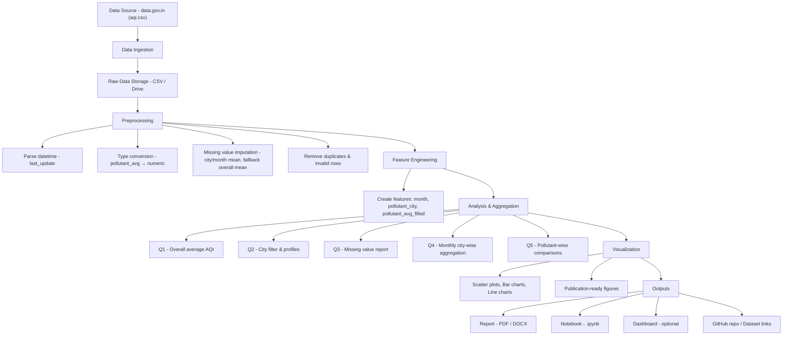
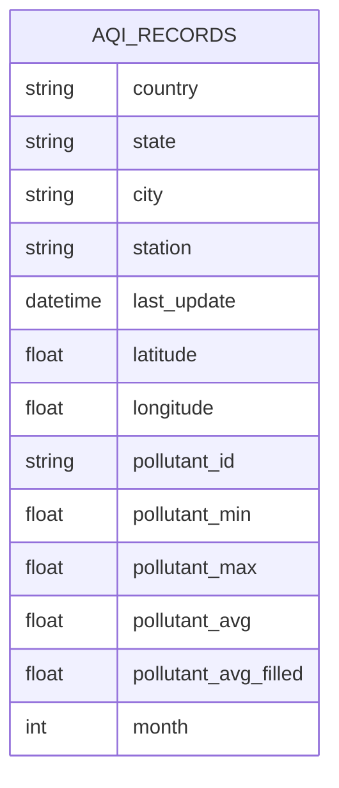

Short explanation:

Data Source → ingest CSV → store raw file.

Preprocessing cleans and fills missing values (city-month mean fallback).

Feature Engineering creates month and pollutant_avg_filled.

Analysis answers Q1–Q5.

Visualization creates publication-ready figures.

Outputs are report, notebook, GitHub repo, and optional dashboard.

2) Logical Dataset Schema (ER-style) — Mermaid ER




Notes:

pollutant_avg_filled is the cleaned column after imputation.

month is derived from last_update for grouping/aggregation.

3) Component Block Diagram (Plain text / ASCII)

```mermaid
+--------------------+     +-----------------------+     +---------------------+
|  Data Source:      | --> |  Raw Data Storage     | --> |  Preprocessing      |
|  data.gov.in (csv) |     |  (aqi.csv on Drive)   |     |  - parse dates      |
+--------------------+     +-----------------------+     |  - to_numeric       |
                                                         |  - impute missing   |
                                                         +---------------------+
                                                                |
                                                                v
                                                     +----------------------------+
                                                     | Feature Engineering:       |
                                                     | - month                    |
                                                     | - pollutant_avg_filled     |
                                                     | - pollutant_city label     |
                                                     +----------------------------+
                                                                |
                                                                v
                                                     +----------------------------+
                                                     | Analysis & Aggregation     |
                                                     | - Q1: overall avg AQI      |
                                                     | - Q2: city filters         |
                                                     | - Q3: missing value stats  |
                                                     | - Q4: monthly city grouping|
                                                     | - Q5: pollutant plots      |
                                                     +----------------------------+
                                                                |
                                                                v
                                                     +----------------------------+
                                                     | Visualization & Outputs    |
                                                     | - matplotlib / seaborn figs |
                                                     | - Notebook (.ipynb)        |
                                                     | - Final report (PDF)       |
                                                     | - GitHub repository        |
                                                     +----------------------------+
```
